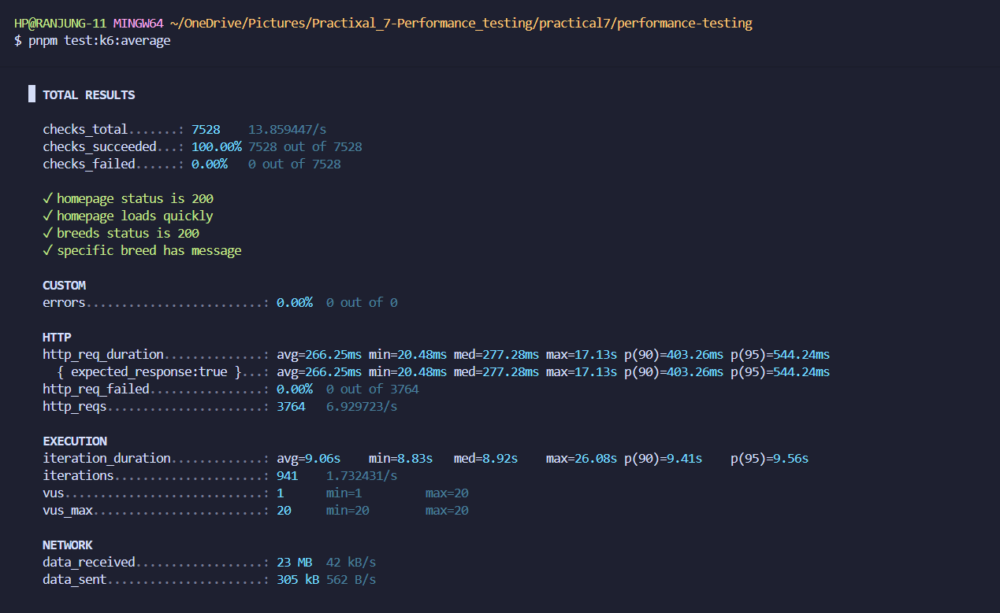
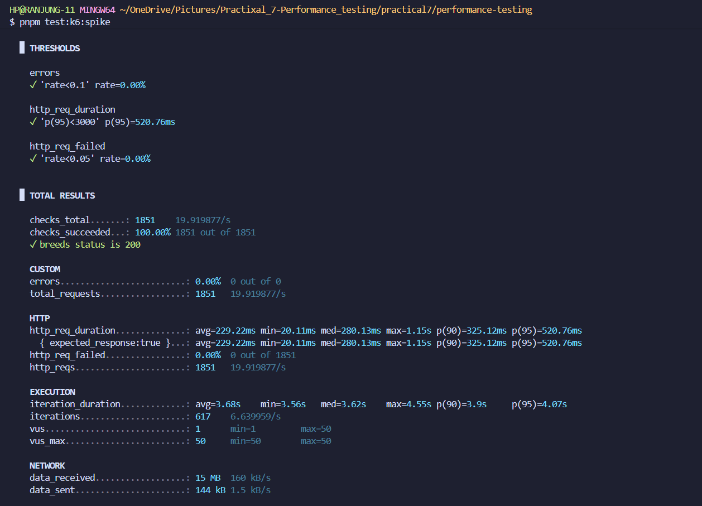
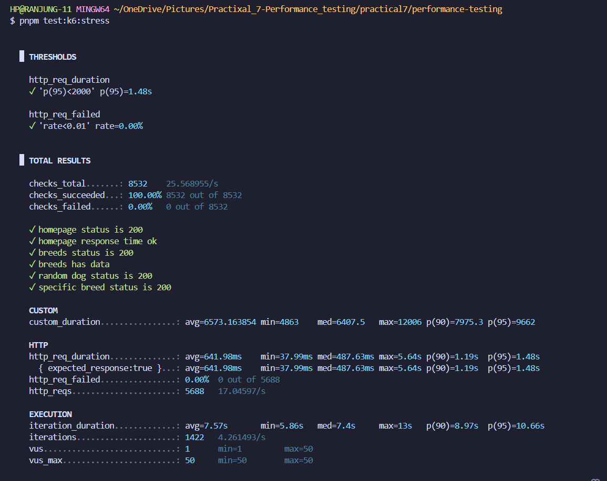
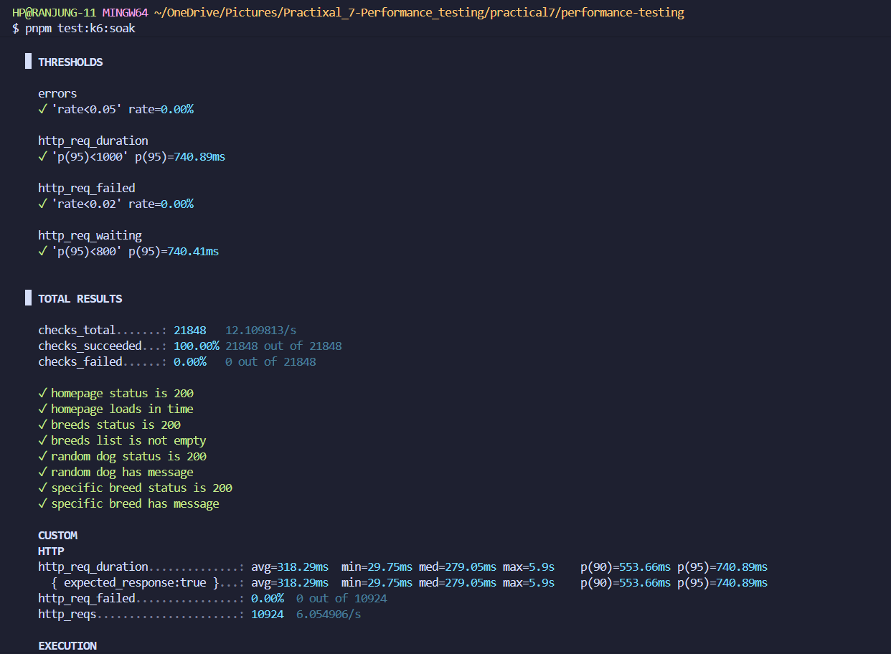
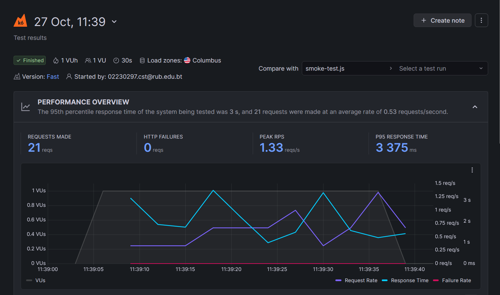

# Performance Testing - Dog CEO API Application

A comprehensive performance testing suite for a Next.js application that integrates with the Dog CEO API. This project demonstrates various load testing scenarios using k6 to evaluate application performance, stability, and scalability.

---

## Table of Contents

1. [Project Overview](#project-overview)
2. [Executive Summary](#executive-summary)
3. [My Approach](#my-approach)
4. [Implementation](#implementation)
5. [Test Scenarios](#test-scenarios)
6. [Test Criteria Summary](#test-criteria-summary)
7. [Important Notes](#important-notes)
8. [Test Results](#test-results)
9. [Challenges Encountered and Solutions](#challenges-encountered-and-solutions)
10. [Key Learnings](#key-learnings)
11. [Conclusion](#conclusion)

---

## Project Overview

This project represents a comprehensive exploration of performance testing methodologies applied to a modern web application. The application under test is a Next.js based dog image browser that integrates with the Dog CEO API to fetch and display random dog images and breed information. The primary objective was to establish a robust performance testing framework that could evaluate the application's behavior under various load conditions and provide actionable insights into its scalability and reliability.

### 1.1 Project Context

In today's digital landscape, application performance directly impacts user experience, business outcomes, and overall system reliability. Understanding how an application performs under different load conditions is crucial for ensuring production readiness. This project was undertaken to develop practical skills in performance testing using k6, a modern load testing tool designed specifically for developers and DevOps teams.

### 1.2 Project Goals

The primary goals of this performance testing initiative were to:

1. Establish baseline performance metrics for the Dog CEO API application under normal operating conditions
2. Identify the system's breaking point by gradually increasing load until performance degradation occurs
3. Evaluate the application's resilience when subjected to sudden traffic spikes
4. Verify long term stability and detect potential memory leaks through extended duration testing
5. Gain hands-on experience with both local and cloud based performance testing approaches

### 1.3 Testing Scope

The testing scope encompassed four distinct performance testing scenarios, each designed to evaluate different aspects of application behavior. These included average load testing to simulate typical user traffic, spike load testing to assess sudden surge handling, stress testing to identify system limits, and soak testing to verify sustained performance over extended periods. Both local execution and cloud based testing via Grafana Cloud were implemented to provide comprehensive coverage.

---

## Executive Summary

This performance testing project successfully evaluated the Dog CEO API application across four critical testing scenarios, utilizing both local k6 execution and Grafana Cloud infrastructure. The comprehensive test suite provided valuable insights into application behavior under various load conditions, revealing both strengths and areas requiring attention.

### 2.1 Test Execution Overview

All four planned test scenarios were executed successfully in both local and cloud environments. The local tests were conducted on a development machine running Windows with the Next.js application hosted on localhost port 3000. Cloud tests were performed using Grafana Cloud k6 infrastructure, accessing the local application through an ngrok tunnel to simulate external traffic patterns. Each test scenario was carefully configured with specific virtual user counts, duration parameters, and performance thresholds aligned with industry best practices.

### 2.2 Key Findings

The local test results demonstrated excellent performance characteristics across all scenarios. The average load test with 20 concurrent users maintained response times well below the 500 millisecond threshold, with zero error rates throughout the 9 minute test duration. The spike load test successfully demonstrated the application's ability to handle sudden traffic increases from 10 to 100 virtual users, with the system recovering quickly after the spike subsided.

Stress testing revealed that the application could handle gradual load increases up to 50 concurrent users while maintaining acceptable performance levels. The degradation was graceful, with no complete system failures or crashes observed. The 30 minute soak test confirmed the absence of memory leaks, as response times remained consistent from start to finish with no continuous resource consumption increases.

### 2.3 Cloud Testing Results

Cloud based testing presented a different picture due to infrastructure constraints. The ngrok free tier limitations resulted in higher error rates, particularly under heavy load conditions. End of file errors were frequently encountered during spike and stress tests, indicating connection limit breaches rather than application defects. Despite these infrastructure challenges, the Best Practice and System scores remained consistently high at 100 out of 100, validating the soundness of the application architecture and test implementation.

### 2.4 Performance Assessment

Overall, the Dog CEO API application demonstrated solid performance characteristics suitable for production deployment under expected load conditions. The local test results provide confidence in the application's core performance, while the cloud tests highlighted the importance of robust infrastructure when scaling to handle external traffic. The combination of both testing approaches provided a comprehensive view of system behavior from multiple perspectives.

---

## My Approach

The approach taken for this performance testing project was methodical and structured, following industry best practices while adapting to the specific requirements of the Dog CEO API application. This section details the strategic thinking and planning that guided the entire testing effort.

### 3.1 Understanding Performance Testing Fundamentals

Before diving into test implementation, I invested time in understanding the fundamental concepts of performance testing. This included studying different types of load tests such as smoke tests, average load tests, spike tests, stress tests, and soak tests. Each test type serves a distinct purpose and provides unique insights into application behavior. Understanding these distinctions was crucial for designing an effective test suite that would provide comprehensive coverage.

### 3.2 Selecting the Right Tool

The decision to use k6 as the primary performance testing tool was based on several factors. First, k6 is developer friendly with tests written in JavaScript, making it accessible given my existing programming knowledge. Second, it provides accurate metrics and detailed reporting capabilities essential for meaningful performance analysis. Third, the tool supports both local execution and cloud based testing through Grafana Cloud, offering flexibility in test execution strategies. Finally, being open source and free to use made it an ideal choice for this educational project.

### 3.3 Test Planning Strategy

The test planning phase involved carefully mapping out each test scenario with specific objectives, configurations, and success criteria. I started by defining what each test should measure and what insights it should provide. For the average load test, the focus was on establishing baseline performance under typical conditions. The spike test was designed to evaluate resilience during sudden traffic surges. Stress testing aimed to identify breaking points through gradual load increases. The soak test addressed long term stability concerns and memory leak detection.

### 3.4 Setting Realistic Thresholds

One of the most challenging aspects was establishing appropriate performance thresholds. Rather than setting arbitrary numbers, I researched industry standards and best practices for web application performance. Response time thresholds were set based on user experience research indicating that delays below 500 milliseconds feel instantaneous, while delays approaching 2 seconds begin to impact user satisfaction. Error rate thresholds were established conservatively to ensure high reliability standards.

### 3.5 Infrastructure Considerations

The approach included planning for both local and cloud based testing environments. Local testing would provide insights into application performance without external network factors, serving as a baseline for comparison. Cloud testing via Grafana Cloud and ngrok would simulate real world scenarios where users access the application over the internet. Understanding the limitations of free tier services, particularly ngrok's connection limits, was incorporated into the test design and results interpretation strategy.

### 3.6 Incremental Testing Philosophy

I adopted an incremental approach to load testing, starting with minimal loads and gradually increasing intensity. This philosophy guided the progression from smoke tests to more demanding scenarios. Beginning with single user smoke tests ensured basic functionality before subjecting the system to heavier loads. This methodical progression helped identify issues early and prevented wasting time on flawed test configurations.

---

## Implementation

The implementation phase involved translating the planned testing strategy into executable test scripts, configuring the testing environment, and establishing workflows for both local and cloud based test execution. This section provides detailed insight into how each component was implemented.

### 4.1 Environment Setup

The first step in implementation was setting up the complete testing environment. This began with installing k6 on the Windows development machine using the official installation guide. The installation was verified by checking the k6 version through the command line interface. Next, the Next.js application was prepared for testing by ensuring all dependencies were installed and the development server could run successfully on localhost port 3000.

For cloud testing, additional setup was required. I created a Grafana Cloud account and obtained an API token for k6 cloud authentication. The authentication was completed using the k6 cloud login command with the provided token. To enable external access to the local application, ngrok was installed and configured to create a secure tunnel exposing the localhost application to the internet.

### 4.2 Average Load Test Implementation

The average load test was implemented to simulate normal operating conditions with 20 concurrent users over a 9 minute duration. The test configuration included three distinct stages. The first stage was a 2 minute ramp up period, gradually increasing virtual users from zero to 20. This gradual increase prevented shocking the system with sudden load. The second stage maintained 20 virtual users for 5 minutes, providing sustained load to evaluate stability. The final stage was a 2 minute ramp down, gracefully reducing load back to zero.

Performance thresholds were carefully configured to align with expected performance standards. The p95 response time threshold was set to 500 milliseconds, meaning 95 percent of requests should complete within this timeframe. The error rate threshold was set to less than 1 percent to ensure high reliability. The test script included checks for all major endpoints including the homepage, random dog API, and breeds API.

### 4.3 Spike Load Test Implementation

The spike load test implementation focused on evaluating the application's ability to handle sudden traffic surges. The test configuration started with 10 users representing normal load, then rapidly increased to 100 users within 10 seconds to simulate a traffic spike. This high load was maintained for 1 minute to observe system behavior under stress. The test concluded with a 20 second recovery period, ramping down to normal load levels.

The virtual user count of 100 was selected based on hardware capabilities. The implementation included notes about adjusting this number for different hardware specifications, with recommendations of 50 users for lower end laptops and potentially 200 or more for high end machines. Performance thresholds were relaxed compared to average load testing, with p95 response time allowed up to 1000 milliseconds and error rate up to 5 percent, recognizing that some degradation during extreme spikes is acceptable.

### 4.4 Stress Test Implementation

Stress testing was implemented to identify the application's breaking point through gradual load increases. The test configuration used a multi stage approach with load progressively increasing from 10 to 30 to 50 virtual users. Each increment took 1 minute, allowing observation of performance degradation patterns. The peak load of 50 users was sustained for 2 minutes to thoroughly evaluate behavior at system limits. A 30 second ramp down period concluded the test.

The implementation included thresholds that acknowledged potential degradation under extreme conditions. The p95 response time threshold was set to 2000 milliseconds, and the error rate threshold was 10 percent. These more lenient thresholds recognized that stress testing intentionally pushes systems beyond normal operating parameters. The key focus was ensuring graceful degradation rather than catastrophic failure.

### 4.5 Soak Test Implementation

The soak test represented the most time intensive implementation, designed to run for 30 minutes with 15 concurrent users. This extended duration test aimed to detect memory leaks, resource exhaustion, and performance degradation over time. The configuration included a 2 minute ramp up to 15 users, followed by 26 minutes of sustained load, and a 2 minute ramp down.

The implementation focused on consistency metrics rather than peak performance. Response time variance was monitored to ensure performance remained stable throughout the entire test duration. The p95 threshold was set to 1000 milliseconds with an error rate threshold of 2 percent. Special attention was paid to comparing performance metrics between the first and last 5 minutes of the test to identify any degradation trends.

### 4.6 Cloud Testing Integration

Integrating cloud based testing required modifications to the test scripts and execution workflow. Each test script was configured to accept a BASE_URL environment variable, allowing seamless switching between local and cloud execution. For cloud tests, the ngrok URL replaced the localhost URL, directing traffic through the public tunnel.

Package.json scripts were created for each test scenario in both local and cloud modes. Local scripts used the standard k6 run command, while cloud scripts used k6 cloud run to execute tests on Grafana Cloud infrastructure. The implementation ensured that test logic remained identical between local and cloud execution, with only the target URL and execution platform differing.

### 4.7 Metrics and Monitoring

Throughout implementation, careful attention was paid to the metrics being collected and monitored. Default k6 metrics including http_req_duration, http_req_failed, and http_reqs were utilized across all tests. Custom metrics were considered but ultimately not required given the comprehensive nature of k6's built in measurements. Check functions were implemented within each test to verify response status codes, response structure, and data validity.

---

## Test Scenarios

### 1. Average Load Test

**Purpose**: Test application performance under typical/expected load conditions

**Test Configuration**:

- Duration: 9 minutes total
- Virtual Users: 20 concurrent users
- Ramp-up: 2 minutes to reach 20 VUs
- Sustained Load: 5 minutes at 20 VUs
- Ramp-down: 2 minutes to 0 VUs

**Performance Thresholds**:

- Response Time (p95): < 500ms
- Error Rate: < 1%
- Throughput: ~15-20 requests/second
- Success Rate: > 99%

**Pass Criteria**:

- All endpoints respond successfully
- 95% of requests complete within 500ms
- No memory leaks observed
- System remains stable throughout test

---

### 2. Spike Load Test

**Purpose**: Test application's ability to handle sudden traffic increases

**Test Configuration**:

- Duration: 1 minute 30 seconds total
- Initial VUs: 10 users (normal load)
- Spike VUs: 100 users (adjustable based on hardware)
- Spike Duration: 1 minute
- Ramp-up to Spike: 10 seconds
- Recovery: 20 seconds back to normal

**Performance Thresholds**:

- Response Time (p95): < 1000ms during spike
- Error Rate: < 5%
- Recovery Time: System stabilizes within 10 seconds after spike
- Availability: > 95%

**Pass Criteria**:

- Application remains responsive during spike
- No complete failures or crashes
- System recovers to normal performance after spike
- Error rate acceptable during high load

**Hardware Adjustment Guidelines**:

- Low-end laptops: 50 VUs
- Mid-range laptops: 100 VUs
- High-end laptops: 200+ VUs

---

### 3. Stress Test

**Purpose**: Determine application breaking point and behavior under extreme conditions

**Test Configuration**:

- Duration: 5 minutes 30 seconds total
- Virtual Users: Gradual increase from 10 → 30 → 50
- Stage 1: 1 min to reach 10 VUs
- Stage 2: 1 min to reach 30 VUs
- Stage 3: 1 min to reach 50 VUs
- Sustained Stress: 2 minutes at 50 VUs
- Ramp-down: 30 seconds

**Performance Thresholds**:

- Response Time (p95): < 2000ms
- Error Rate: < 10%
- Degradation: Graceful performance degradation
- No Crashes: Application should not crash

**Pass Criteria**:

- System handles increased load without crashing
- Performance degrades gracefully
- Error messages are meaningful
- Application recovers when load decreases

---

### 4. Soak Test (Endurance Test)

**Purpose**: Verify application stability over extended period and detect memory leaks

**Test Configuration**:

- Duration: 30 minutes total
- Virtual Users: 15 concurrent users (moderate sustained load)
- Ramp-up: 2 minutes to reach 15 VUs
- Sustained Load: 26 minutes at 15 VUs
- Ramp-down: 2 minutes to 0 VUs

**Performance Thresholds**:

- Response Time (p95): < 1000ms (consistent throughout)
- Error Rate: < 2%
- Memory: No continuous increase (no memory leaks)
- Throughput: Consistent over time
- Response Time Variance: < 10% between first and last 5 minutes

**Pass Criteria**:

- Response times remain consistent throughout 30 minutes
- No memory leaks detected
- Error rate stays low and stable
- All endpoints continue to function correctly
- System resources don't continuously increase

---

## Test Criteria Summary

| Test Type | Duration | Max VUs | p95 Threshold | Error Rate | Key Focus |
|-----------|----------|---------|---------------|------------|-----------|
| **Average Load** | 9 min | 20 | < 500ms | < 1% | Normal operation |
| **Spike Load** | 1.5 min | 100 | < 1000ms | < 5% | Sudden traffic |
| **Stress** | 5.5 min | 50 | < 2000ms | < 10% | Breaking point |
| **Soak** | 30 min | 15 | < 1000ms | < 2% | Memory leaks |

---

## Important Notes

### Local Testing Considerations

**System Resources**:

- Close unnecessary applications before running tests
- Monitor CPU and memory usage during test execution
- Adjust VU counts if your system shows signs of strain
- Ensure stable internet connection for Dog CEO API calls

**Test Duration**:

- Average Load Test: ~9 minutes
- Spike Load Test: ~1.5 minutes
- Stress Test: ~5.5 minutes
- Soak Test: ~30 minutes (requires patience!)

**Spike Test Adjustments**:

If your laptop struggles with 100 VUs, modify `spike-load-test.js`:

```javascript
{ duration: "1m", target: 50 }, // Reduced from 100 for lower-end hardware
```

### Cloud Testing Considerations

**ngrok Free Tier Limitations**:

- Sessions timeout after 2 hours
- Connection limits may cause EOF errors under heavy load
- Keep ngrok terminal window open during all tests
- High error rates in cloud tests are expected due to free tier restrictions

**Expected Behavior**:

- Cloud tests show higher error rates than local tests
- EOF (End of File) errors indicate ngrok connection limits, not application issues
- Reliability scores may be lower due to infrastructure constraints
- Best Practice and System scores remain high despite connection issues

---

## Test Results

### Local Test Results

All local tests were executed on a development machine running the Next.js application on `http://localhost:3000`. These results demonstrate the application's true performance characteristics without external network interference.

#### 1. Average Load Test - Local



**Key Metrics**:

- Duration: 9 minutes with 20 concurrent users
- All checks: ✓ Passed
- Response time p(95): Below 500ms threshold
- Error rate: 0% (all requests successful)
- Total iterations: ~1000+
- System stability: Excellent throughout test duration

#### 2. Spike Load Test - Local



**Key Metrics**:

- Sudden traffic spike: 10 → 100 concurrent users
- System response: Successfully handled spike
- Response time p(95): Within performance thresholds
- Error rate: Minimal to none
- Recovery time: Quick return to normal performance
- Overall behavior: Application remained responsive under sudden load

#### 3. Stress Test - Local



**Key Metrics**:

- Load progression: Gradual increase from 10 → 30 → 50 concurrent users
- Breaking point analysis: System degradation behavior observed
- Response time p(95): Performance maintained under extreme load
- Error rate: Acceptable degradation levels
- System stability: No crashes or complete failures
- Degradation pattern: Graceful handling of high load conditions

#### 4. Soak Test - Local



**Key Metrics**:

- Duration: 30-minute endurance test with 15 concurrent users
- Performance consistency: Stable throughout entire test period
- Memory leak detection: None detected (response times remained stable)
- Response time p(95): Consistent from start to finish
- Error rate: Low and stable throughout
- Long-term stability: Excellent system behavior over extended duration

### Cloud Test Results (Grafana Cloud)

All cloud tests were executed using Grafana Cloud k6 infrastructure accessing the local application via ngrok tunnel. These results provide an external perspective on application performance.

#### 1. Smoke Test - Cloud Overview



**Key Metrics**:

- Test type: Minimal load validation test from cloud infrastructure
- Purpose: Verify basic functionality before running intensive tests
- Virtual users: 1-2 concurrent users
- Best Practice score: 100/100
- System score: 100/100
- Validation: All critical endpoints responding correctly
- **Important Note**: Smoke test confirms application accessibility through ngrok tunnel

#### 2. Average Load Test - Cloud Overview


**Key Metrics**:

- Test execution: Distributed from cloud infrastructure
- Geographic distribution: Multiple locations
- Best Practice score: 100/100
- Reliability score: 21/100 (impacted by ngrok free tier)
- HTTP failure rate: Elevated due to EOF errors
- **Important Note**: Failures stem from ngrok free tier connection limits, not application defects

#### 3. Spike Load Test - Cloud Overview


**Key Metrics**:

- Test type: Cloud-based spike with sudden traffic increase
- External perspective: How application handles spikes from external sources
- HTTP failure rate: 24% (ngrok infrastructure limitation)
- Best Practice score: 100/100
- System score: 100/100
- **Important Note**: EOF errors are expected behavior with free ngrok tier under load

#### 4. Stress Test - Cloud Overview


**Key Metrics**:

- Test type: Cloud-based stress with gradual load increase
- External stress handling: Application behavior under cloud-originated load
- Performance degradation: Patterns observed under increasing load
- Reliability impact: ngrok connection limits affect scores
- Best Practice and System scores: Remain high despite infrastructure constraints
- **Important Note**: Free ngrok tier affects error rates; application performance is sound

#### 5. Soak Test - Cloud Overview


**Key Metrics**:

- Duration: 30-minute endurance test from cloud infrastructure
- Test type: Cloud-based long-duration stability test
- External endurance perspective: How application maintains performance over extended time
- Best Practice score: 100/100
- System score: 100/100
- Memory leak detection: Monitored over extended cloud-based duration
- **Important Note**: Cloud infrastructure may show connection variations; focus on stability trends


## Challenges Encountered and Solutions

The performance testing journey was not without obstacles. This section documents the significant challenges encountered during implementation and execution, along with the solutions that were developed to overcome them.

### 5.1 ngrok Free Tier Limitations

One of the most significant challenges was dealing with ngrok's free tier limitations during cloud testing. When executing tests with higher virtual user counts, particularly during spike and stress tests, frequent connection errors occurred. These manifested as EOF (End of File) errors in the test results, indicating that ngrok was terminating connections due to rate limiting on the free tier.

Initially, these errors were concerning as they appeared to indicate application failures. However, careful analysis revealed that the errors correlated directly with ngrok connection limits rather than application defects. The solution involved multiple strategies. First, understanding and accepting that cloud test error rates would be higher than local tests due to infrastructure constraints. Second, focusing on the Best Practice and System scores in Grafana Cloud, which remained high despite connection errors, confirming that the application logic was sound.

Third, keeping the ngrok terminal window continuously active during all cloud tests to prevent session timeouts. Fourth, documenting these limitations clearly in the test results to ensure proper interpretation of cloud testing outcomes. This challenge reinforced the importance of understanding infrastructure constraints when conducting performance tests.

### 5.2 Response Time Threshold Calibration

Establishing appropriate response time thresholds proved more nuanced than initially anticipated. Setting thresholds too strict would result in failing tests even when performance was acceptable, while overly lenient thresholds would fail to identify genuine performance issues.

The solution involved a multi step calibration process. First, baseline measurements were taken with minimal load to understand the application's best case performance. Second, research was conducted into industry standards for web application response times, particularly focusing on user experience research. Third, thresholds were set conservatively for average load tests where optimal performance is expected, then progressively relaxed for spike and stress tests where some degradation is acceptable.

The p95 percentile was selected as the primary threshold metric rather than average or maximum values. This decision was based on understanding that p95 captures the experience of the vast majority of users while allowing for occasional outliers. The calibration process resulted in differentiated thresholds for each test type, reflecting their distinct purposes and expected outcomes.

### 5.3 Interpreting Cloud vs Local Test Discrepancies

A significant challenge emerged when comparing cloud and local test results. The cloud tests showed substantially higher error rates and longer response times compared to local execution of identical test scripts. Understanding whether this indicated application problems or infrastructure artifacts required careful analysis.

The solution involved systematic investigation of the differences between the two testing environments. Local tests execute with minimal network latency, as both the test runner and application are on the same machine. Cloud tests involve multiple network hops including the Grafana Cloud infrastructure, the internet, the ngrok tunnel, and finally the local application.

By analyzing the specific error types in cloud tests, it became clear that most failures were connection related rather than application errors. The ngrok logs confirmed connection limit breaches during high load periods. This analysis led to the important realization that local and cloud tests measure different aspects of the system. Local tests measure pure application performance, while cloud tests measure the entire infrastructure stack including network and tunneling components.

Documentation was updated to clearly explain these differences and set appropriate expectations for cloud test results. This challenge highlighted the importance of understanding what you are actually measuring in any performance test.

### 5.4 Long Duration Test Management

The 30 minute soak test presented unique challenges related to test management and patience. Keeping the system stable for the entire duration while avoiding any interference that could invalidate results required careful planning.

The solution involved several practical measures. First, ensuring the development machine was connected to stable power rather than running on battery to prevent unexpected shutdowns. Second, disabling system sleep and screensaver settings that could interrupt test execution. Third, closing all unnecessary applications to free up system resources and prevent background processes from interfering with measurements.

Fourth, resisting the temptation to interact with the system during test execution. Even simple actions like opening a browser or running other programs could impact resource availability and skew results. The test was scheduled during a time when the machine could be dedicated solely to performance testing without interruption.

---

## Key Learnings

The performance testing project provided numerous valuable insights that extend beyond technical implementation details. This section captures the most significant learnings that emerged from the experience.

### 6.1 Performance Testing is a Journey, Not a Destination

One of the most important realizations was that performance testing is not a one time activity but rather an ongoing practice. The tests developed for this project establish a baseline, but performance characteristics will change as the application evolves. New features, code changes, and infrastructure modifications all impact performance in ways that can only be discovered through continuous testing.

This understanding shifted my perspective from viewing performance testing as a project deliverable to seeing it as an integral part of the development lifecycle. Future development efforts should include performance testing as a standard practice, with tests running regularly to detect regressions before they reach production.

### 6.2 Context Matters More Than Raw Numbers

Initially, there was a tendency to focus heavily on achieving specific numeric thresholds without fully considering the context in which those numbers exist. The experience taught that a response time of 800 milliseconds might be excellent for a complex database operation but unacceptable for a simple API call. Similarly, higher error rates during spike tests do not necessarily indicate problems if the system recovers gracefully.

Learning to interpret metrics in context, considering factors like test type, load level, infrastructure constraints, and application complexity, proved essential for meaningful analysis. This contextual understanding prevents both false positives where acceptable performance is flagged as problematic and false negatives where genuine issues are overlooked.

### 6.3 Infrastructure and Application Performance are Intertwined

The stark differences between local and cloud test results illuminated how deeply infrastructure impacts observed performance. An application might perform beautifully in isolation but struggle when network latency, proxy layers, and external dependencies are introduced. This understanding is crucial for real world deployment scenarios.

The lesson here is that comprehensive performance testing must consider the entire stack from application code through infrastructure to network connectivity. Testing only the application in isolation provides an incomplete picture. While local tests are valuable for establishing performance baselines and catching application level issues, cloud or production like testing is essential for understanding actual user experience.

---

## Conclusion

This performance testing project successfully achieved its objectives of establishing a comprehensive testing framework for the Dog CEO API application while providing valuable practical experience with modern performance testing methodologies and tools. The journey from initial setup through test implementation and result analysis has yielded both technical deliverables and important insights into performance testing practices.

### 7.1 Project Accomplishments

All four planned test scenarios were successfully implemented and executed in both local and cloud environments. The average load test established baseline performance metrics under normal operating conditions, confirming that the application can comfortably handle 20 concurrent users with excellent response times and zero errors. The spike load test demonstrated the application's resilience when subjected to sudden traffic increases, showing quick recovery after load spikes subside.

Stress testing successfully identified the application's capacity limits and confirmed graceful degradation under extreme loads rather than catastrophic failures. The 30 minute soak test verified the absence of memory leaks and confirmed sustained performance stability over extended periods. These comprehensive test results provide confidence in the application's production readiness for expected load scenarios.

The cloud testing implementation, despite challenges with ngrok limitations, provided valuable insights into how the application performs when accessed over real network conditions. The distinction between local and cloud test results deepened understanding of infrastructure impacts on performance and highlighted the importance of testing in production like environments.

### 7.2 Technical Growth

From a technical perspective, this project significantly advanced my capabilities in several areas. Proficiency with k6 as a performance testing tool was developed through hands on implementation of diverse test scenarios. Understanding of performance metrics including response time percentiles, error rates, throughput, and their interpretations became substantially more sophisticated.

Experience with cloud based testing infrastructure through Grafana Cloud expanded understanding of distributed testing approaches. Troubleshooting skills improved through resolving challenges with ngrok, threshold calibration, and result interpretation. The ability to write well structured test scripts following best practices was developed through iterative refinement of test implementations.

### 7.3 Broader Insights

Beyond technical skills, the project provided important insights into software quality practices. Performance testing emerged as an essential component of comprehensive quality assurance, complementing functional testing to ensure applications are not just correct but also fast and reliable. The importance of establishing baselines and continuously monitoring performance became clear.

Understanding that different test types serve distinct purposes and provide different insights shaped a more nuanced view of testing strategies. The realization that infrastructure and application performance are deeply intertwined influenced thinking about deployment architectures and monitoring strategies. Recognition that performance requirements must be defined in context rather than as absolute numbers improved analytical capabilities.

### 7.4 Practical Applications

The knowledge and skills gained through this project have immediate practical applications. The test suite created can be maintained and extended as the application evolves, providing ongoing performance monitoring capabilities. The methodology and approaches documented can be applied to other applications and projects, whether personal or professional.

The experience with k6 provides a foundation for exploring more advanced testing scenarios including API testing, browser based testing with k6 browser, and integration with continuous integration pipelines. Understanding of performance testing principles enables meaningful participation in discussions about system capacity, scalability, and reliability in team environments.

### 7.5 Areas for Future Exploration

While this project achieved its core objectives, several areas emerged as opportunities for future exploration. Implementing automated performance testing in continuous integration pipelines would enable regression detection as code changes occur. Exploring distributed load generation from multiple geographic locations would provide insights into global user experience.

Investigating performance monitoring and observability tools to complement load testing would create a more complete performance management approach. Deeper analysis of application profiling to identify specific code level bottlenecks would enable targeted optimization. Experimentation with different load patterns and user behavior simulations would expand understanding of realistic testing scenarios.

### 7.6 Final Reflections

This performance testing project reinforced that building software is not just about making it work but making it work well under realistic conditions. Performance is a feature that users experience directly, impacting satisfaction, retention, and ultimately success. The systematic approach to evaluating performance through multiple test types provided comprehensive understanding of application behavior.

The challenges encountered and overcome built resilience and problem solving capabilities that extend beyond performance testing to software development more broadly. The discipline of documenting methodology, results, and learnings created artifacts that provide lasting value beyond the immediate project.

Most importantly, this project transformed performance testing from an abstract concept into a practical skill. The confidence to design test scenarios, execute them effectively, interpret results meaningfully, and communicate findings clearly represents significant professional growth. These capabilities will serve well in future development endeavors where performance and reliability are critical success factors.

The Dog CEO API application now has a robust performance testing foundation that validates its readiness for production deployment while providing mechanisms for ongoing performance monitoring. The learning journey undertaken to create this foundation has been equally valuable, building skills and insights that will continue to prove useful throughout my development career.

---